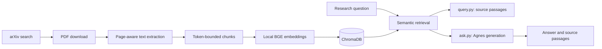

# Literature Review Engine

A Python engine for managing a reproducible review ledger and exploring locally indexed academic papers with an Agnes-powered assistant.

The review ledger stores systematic or scoping review projects, bibliography imports, captured PubMed searches, conservative deduplication, reviewer decisions, manual report/study links, and reconciled counts. It retains immutable TXT/JATS/PDF sources, manual structured findings/appraisals, exact quotations, revision history and independent verification. Project passage retrieval searches those retained sources and returns exact anchors for reviewer inspection. Verified evidence exports use current eligible sources and resolved study associations. PubMed receipts and original response bytes survive export and offline replay. The separate ingestion and retrieval-augmented generation (RAG) pipeline supports exploring paper passages.

## Current workflow

```mermaid
flowchart LR
    PubMed[PubMed search] --> Capture[Verify membership and preserve receipt / response bytes]
    Capture --> Import
    Export[Saved JSON / RIS / PubMed XML] --> Import[Import and preserve every occurrence]
    Import --> Ledger[(SQLite review project)]
    Ledger --> Dedup[Conservative record deduplication]
    Dedup --> Screening[Reviewer decisions and adjudication]
    Screening --> Fulltext[Full-text retrieval and assessment]
    Fulltext --> Counts[Reconciled counts and JSON / CSV exports]
    Fulltext --> Link[Audited report / study associations]
    Link --> Counts
    Link --> Sources[Retain original source versions]
    Sources --> Candidates[Retrieve exact passage candidates]
    Candidates --> Findings
    Sources --> Findings[Manual findings and appraisal judgments]
    Findings --> Verify[Independent revision verification]
    Verify --> Evidence[Verified evidence plus complete audit exports]
```



`review.py` runs offline for imports, screening, project passage retrieval, source/evidence review, counts, export and saved-capture verification; `search-pubmed` explicitly executes an NCBI search. Ledger operations, lexical retrieval and TXT/JATS parsing use Python's standard library; PDF attachment lazily uses PyMuPDF. Full-text retrieval status, eligibility and extracted findings are recorded by reviewers.

The passage exploration pipeline remains separate:



- `main.py` searches arXiv and indexes available PDFs.
- `query.py` retrieves passages with paper metadata and PDF page numbers.
- `ask.py` generates a short answer with source labels and prints the supporting passages.

Embeddings run locally using `BAAI/bge-small-en-v1.5`. Ingestion and retrieval require no LLM API key. Answer generation sends the question and retrieved passages to the configured Agnes API.

## Requirements and installation

Python 3.12 is recommended. The ledger, PubMed adapter and TXT/JATS evidence workflow require no third-party packages or paid API key. PDF source attachment uses PyMuPDF, included in the runtime dependencies below. Live PubMed requests require a contact email; an NCBI API key is optional. An internet connection is needed for PubMed/arXiv searches, PDF downloads, the first embedding-model download, and Agnes generation. Install the runtime dependencies below to use PDF parsing or the passage pipeline.

```bash
git clone https://github.com/hnt119/lit-rev-engine.git
cd lit-rev-engine
python3 -m venv .venv
source .venv/bin/activate
python -m pip install --upgrade pip
python -m pip install -r requirements.txt
```

On Windows, create and activate the environment with:

```powershell
py -3.12 -m venv .venv
.\.venv\Scripts\Activate.ps1
python -m pip install --upgrade pip
python -m pip install -r requirements.txt
```

For Command Prompt, use `.venv\Scripts\activate.bat` instead of the PowerShell activation command.

`requirements.txt` lists the direct runtime dependencies. `requirements-dev.txt` adds pytest. The previous complete environment freeze is retained as `requirements.lock.txt`; it is an optional constraints file, rather than a second list of packages to install:

```bash
python -m pip install -r requirements-dev.txt -c requirements.lock.txt
```

## Usage

### Manage a review project

Create a project, then copy its returned `id` into the variable below:

```bash
python review.py create --title "My scoping review" --type scoping \
  --question "Enter the review question" --protocol "Enter the protocol reference"

REVIEW_PROJECT_ID="COPY_PROJECT_ID_FROM_CREATE_OUTPUT"
python review.py import "$REVIEW_PROJECT_ID" examples/review/synthetic-records.json \
  --source "Synthetic demonstration" --import-key demo-v1
python review.py history "$REVIEW_PROJECT_ID"
python review.py records "$REVIEW_PROJECT_ID"
```

The synthetic example has six imported occurrences, two duplicates, and four unique records. It describes no real publications. For a real database export, supply the exact executed `--query`, actual `--searched-at` ISO date/time, and any `--filters-json`, `--reported-count`, and `--notes`. Unknown query/date fields stay null. The import stores the source-file SHA-256 and raw record provenance; a checksum does not establish that an export was complete. Supported formats and a reproducible multi-format example are documented in [Import formats](docs/import-formats.md).

Use an actual record `id` from `records` to record decisions:

```bash
REVIEW_RECORD_ID="COPY_RECORD_ID_FROM_RECORDS_OUTPUT"
python review.py screen "$REVIEW_PROJECT_ID" "$REVIEW_RECORD_ID" \
  --stage title_abstract --decision include --reviewer reviewer-1
python review.py fulltext "$REVIEW_PROJECT_ID" "$REVIEW_RECORD_ID" \
  --status requested --reviewer reviewer-1
python review.py fulltext "$REVIEW_PROJECT_ID" "$REVIEW_RECORD_ID" \
  --status retrieved --reviewer reviewer-1
python review.py screen "$REVIEW_PROJECT_ID" "$REVIEW_RECORD_ID" \
  --stage full_text --decision exclude --reviewer reviewer-1 \
  --reason "Enter the actual eligibility reason"
python review.py counts "$REVIEW_PROJECT_ID"
python review.py export "$REVIEW_PROJECT_ID" /tmp/review-export
```

Every screening revision is retained with reviewer identity and reason. The latest vote per reviewer determines the current state; disagreements become `conflict`, and `uncertain` remains unresolved. `adjudicate` takes the same screening arguments with a required `--reason`; later reviewer votes invalidate an earlier adjudication. This version does not enforce a required number of independent reviewers. Exclusions and unsuccessful full-text retrieval require reasons.

Only title/abstract inclusions can enter full-text retrieval, and full-text assessment requires `retrieved`. Once retrieval starts, title/abstract changes must preserve inclusion. Retrieved status is terminal in this version; reopening prior stages requires a future explicit operation.

Exports include a versioned `project.json` bundle, records, search runs, original occurrences, all decision/retrieval events, active exclusion reasons, and counts in JSON/CSV. Seven reconciliation checks account for pending screening, retrieval, assessment, and unresolved decisions; projects using manual study linkage add an eighth report-linkage partition. Export fails if an arithmetic check fails. `included_studies` stays null until linkage is available and complete for all current full-text inclusions. Each export reads one consistent SQLite snapshot; replacing the separate output files is not a single atomic directory operation.

CSV uses standard quoting and prefixes a single quote to user text beginning with spreadsheet formula characters (`=`, `+`, `-`, `@`, tab, carriage return). JSON retains the exact original text. Repeated exports of an unchanged ledger are deterministic. Without `--import-key`, each import adds a new historical run; an identical keyed retry returns the original result, while changed input under that key fails.

The default database is repository `data/reviews.sqlite3`. To use a separate database, put `--db PATH` before the command. Run `python review.py --help` for all commands. Preserve the SQLite file to retain your review; the passage index is a separate artifact.

### Capture and replay a PubMed search

Set `NCBI_EMAIL` to your contact email and optionally `NCBI_API_KEY` in your shell. The review CLI reads these environment variables directly and does not load `.env`. Use your actual protocol query and a new output directory:

```bash
PUBMED_QUERY="REPLACE_WITH_YOUR_EXACT_PUBMED_QUERY"
python review.py search-pubmed "$REVIEW_PROJECT_ID" --query "$PUBMED_QUERY" \
  --output data/pubmed-captures/my-first-search --import-key pubmed-001
python review.py verify-pubmed data/pubmed-captures/my-first-search
python review.py import-pubmed "$REVIEW_PROJECT_ID" data/pubmed-captures/my-first-search \
  --import-key pubmed-001
```

The first command searches, captures complete PMID membership and citation XML, then imports it. The other commands run offline; verification opens no ledger. Inspect the saved translated query and warnings. Identical keyed replay returns the original run, including from a moved or exported capture. SQLite retains the receipt and exact ESearch/EFetch/combined XML bytes, so deleting the original folder does not lose them. Export adds a hash/size manifest and `search_captures/<run_id>/` assets to the normal ledger files.

This version accepts at most 10,000 PubMed matches and fails on truncation or wrong membership. A larger search needs a separately validated segmentation/EDirect workflow. If capture succeeds but import fails, the complete folder is retained and the error gives an offline recovery command. Supported date/sort options, rate limits, failure behavior, and a fully offline synthetic example are in [PubMed capture and replay](docs/pubmed-search.md). Capture completeness describes saved membership; it does not establish comprehensive biomedical coverage or clinical evidence quality.

### Link reports to studies

Create a manual study identity after checking source/registry information, then copy its returned ID:

```bash
python review.py study-create "$REVIEW_PROJECT_ID" --label "Enter the study label" \
  --reviewer reviewer-1 --reason "Enter the source evidence establishing this identity"
REVIEW_STUDY_ID="COPY_STUDY_ID_FROM_CREATE_OUTPUT"
python review.py link-studies "$REVIEW_PROJECT_ID" "$REVIEW_RECORD_ID" \
  --study-id "$REVIEW_STUDY_ID" --reviewer reviewer-1 \
  --reason "Enter the evidence associating this report with this study"
python review.py links "$REVIEW_PROJECT_ID" --record-id "$REVIEW_RECORD_ID"
python review.py studies "$REVIEW_PROJECT_ID"
python review.py counts "$REVIEW_PROJECT_ID"
```

Several reports can share a study ID, and one report can link to several studies using repeated `--study-id` flags. Each event replaces that reviewer's complete set; `--clear` explicitly records an empty set. Disagreements remain conflicts, `adjudicate-links` requires existing reviews and a reason, and later reviews invalidate an adjudication. Labels and supplied `--identifiers-json` metadata never auto-merge study identities.

Linking does not change eligibility. Only current full-text-included reports contribute to study totals. Missing, empty, or conflicting links leave `included_studies=null` while `linked_included_studies` exposes a partial observed total. Complete linkage counts distinct study IDs, preserving every report and association revision. Projects using linkage export `studies.csv`, `study_links.csv`, and `study_link_events.csv` plus corresponding bundle arrays. See [study linkage](docs/study-linkage.md) for the independent six-report/three-study example and [evaluation evidence](docs/study-linkage-evaluation.md).

### Retain original report sources

Source attachment retains version history, hashes and exact quotation blocks for UTF-8 text, publisher JATS XML, and text-bearing PDFs. JATS own DOI/PMID checks can reject a wrong report association; XML reference lists and peer-review sub-articles are excluded from finding passages. PDF locators use actual page positions. Every source version survives export and original-file deletion. Source attachment does not change screening status.

```bash
python review.py attach-source "$REVIEW_PROJECT_ID" "$REVIEW_RECORD_ID" article.xml \
  --format jats_xml --reviewer reviewer-1 --reason "Checked this source against the report"
REVIEW_DOCUMENT_ID="COPY_DOCUMENT_ID_FROM_OUTPUT"
python review.py source-blocks "$REVIEW_PROJECT_ID" "$REVIEW_DOCUMENT_ID"
python review.py documents "$REVIEW_PROJECT_ID" --record-id "$REVIEW_RECORD_ID"
```

See [source documents](docs/source-documents.md) for API usage, transformations and limitations.

### Find passages in retained project sources

```bash
python review.py retrieve-sources "$REVIEW_PROJECT_ID" \
  --query "Enter the population, outcome and timepoint" \
  --method bm25 --scope included --top-k 5 > retrieval-trace.json
```

`included` searches active sources of currently full-text-included reports. Use `--scope all_attached` explicitly to inspect pending or excluded reports during screening. Superseded sources remain in the audit history but do not supply candidates. `bm25` (the default), `token_overlap` and optional `bm25_context` return exact Unicode quotation bounds, original locators, source/block hashes, screening/linkage state and a hashed source manifest from one SQLite snapshot. The context method adds separate exact anchors for a preceding XML paragraph used in scoring; those context quotes do not become the candidate finding anchor. Save the entire JSON trace to retain its query, method/version/parameters and provenance.

These commands initialize no embeddings, Chroma collection or generation service and create no ledger search or evidence events. Scores rank lexical matches; they do not establish answerability or clinical support. Inspect candidates, enter values/context manually and verify the resulting extraction independently. See the [executed synthetic guide](docs/project-retrieval.md) for scope, active-version and direct-anchor reuse examples.

### Enter and verify evidence

Prepare a JSON payload containing `study_id`, `document_id`, `field`, finite `value`, `context`, and an exact `anchor` (`block_id`, half-open character `start`/`end`, and `quote`). Use an included report, its active document and a resolved association with the selected study. The [executable offline guide](docs/verified-evidence.md) creates complete finding/appraisal payloads and exercises revisions, disagreement, source replacement and export.

```bash
python review.py propose-evidence "$REVIEW_PROJECT_ID" "$REVIEW_RECORD_ID" \
  --payload evidence-proposal.json --reviewer reviewer-1 --reason "Entered value and source context"
REVIEW_REVISION_ID="COPY_REVISION_ID_FROM_OUTPUT"
python review.py review-evidence "$REVIEW_PROJECT_ID" "$REVIEW_REVISION_ID" \
  --decision confirm --reviewer reviewer-2 --reason "Checked quotation, value and context independently"
python review.py evidence "$REVIEW_PROJECT_ID" --verified-only
python review.py evidence-history "$REVIEW_PROJECT_ID"
python review.py export "$REVIEW_PROJECT_ID" /tmp/review-export
```

`revise-evidence` takes the stable `evidence_id` and a complete replacement payload. Verification takes its current revision `id`; a different named reviewer must confirm/reject/adjudicate it. Disagreement remains visible, explicit adjudication requires prior reviews, and any later review invalidates adjudication. Edits inherit no confirmations. Replacing a source makes old revisions stale; changed eligibility, unresolved links or source-identifier contradictions suppress verified output while retaining audit history. Reviewer names are declared identities, without authentication or an enforced quorum.

Appraisal payloads use `kind="appraisal"`, a judgment string, and explicit `appraisal` instrument/instrument_version/domain metadata chosen in the review protocol. The engine computes no overall quality score. Exact quote validation establishes location; reviewers must assess whether the entered finding and context are supported. Exports add complete evidence/revision/review audit arrays and CSVs, plus separate `verified_evidence.json`/CSV. Screening count reconciliation does not imply complete extraction or clinical validity. See [independent evidence checks](docs/evidence-evaluation.md).

### 1. Search and index papers

```bash
python main.py
```

Enter a keyword query when prompted. The default search limit is five papers. The pipeline downloads available PDFs, extracts text page by page, and creates chunks that fit the embedding model's token limit.

A failed download or unreadable PDF is reported and skipped. PDFs with no extractable text are skipped; scanned documents may require OCR. Empty searches and batches do not load the embedding model or clear the existing vector index.

### 2. Retrieve source passages

```bash
python query.py
```

Enter a focused research question. Results include the paper title, paper ID, chunk ID, vector distance, paper URL, PDF page number, local PDF path, and full retrieved passage when those fields are available.

Page numbers are one-based positions in the PDF file; they may differ from the page numbers printed in a journal article.

### 3. Generate an answer with Agnes

Copy `.env.example` to `.env` and set your key:

```dotenv
AGNES_API_KEY=your_key_here
AGNES_BASE_URL=https://apihub.agnes-ai.com/v1
AGNES_MODEL=agnes-2.0-flash
```

Then run:

```bash
python ask.py
```

The assistant uses up to `top_k` retrieved passages, asks Agnes to cite factual claims using `[Source 1]` labels, and shows the passages alongside the answer. Short passages are retained by default. If retrieval produces no usable passages, no generation request is made and no API key is needed.

The application rejects answers with missing or malformed source labels, labels referring to nonexistent sources, empty responses, and completions truncated by the token budget. Agnes can also return an explicit insufficient-evidence response.

**Citation validation checks labels, not whether each claim is supported.** Every generated claim and numerical result still needs verification in the original report. Nearest-neighbor retrieval returns the closest available passages even when the collection does not contain an answer.

`test_agnes.py` is a separate, optional live API smoke test:

```bash
python test_agnes.py
```

It sends an actual generation request and is excluded from the automated test suite.

## Configuration

`src/settings.py` is the shared configuration for ingestion, chunking, embeddings, retrieval, storage, and generation. `.env` is loaded from the repository root. Default data paths also resolve from the repository root, so changing the shell's working directory does not create a different index.

| Setting | Default | Purpose |
|---|---|---|
| `data_directory` | repository `data/` | Generated artifacts |
| `max_search_results` | `5` | Maximum arXiv results per ingestion |
| `chunk_size` | `300` | Word ceiling per chunk |
| `chunk_overlap` | `50` | Requested overlap in words |
| `embedding_model` | `BAAI/bge-small-en-v1.5` | Local embedding model |
| `top_k` | `5` | Retrieval and answer source limit |
| `chroma_directory` | `None` | Override index path; otherwise `data_directory/chroma` |
| `chroma_collection` | `research_chunks` | Chroma collection name |
| `max_source_distance` | `None` | Optional distance cutoff for answer sources |
| `max_tokens` | `5000` | Agnes completion token budget |
| `temperature` | `0.2` | Agnes generation temperature |

The tokenizer, including special tokens, determines the actual chunk length. A chunk may contain fewer than 300 words to fit the model. Overlap is reduced when necessary to ensure progress. Oversized embedding inputs are rejected instead of silently truncated; shorten unusually long research questions.

The default BGE model has a 512-token input limit. [BGE model documentation](https://huggingface.co/BAAI/bge-small-en-v1.5).

The index uses Chroma's L2 distance with normalized vectors. Lower distances indicate closer embeddings; distance is not a probability or evidence-quality score. Leave `max_source_distance=None` until a cutoff has been evaluated against your own corpus. A cutoff filters retrieved passages; it does not establish factual support.

## Repeated ingestion and existing indexes

Chunk IDs are deterministic within each arXiv report version. Re-ingesting a successfully parsed paper upserts its full chunk set and deletes obsolete chunk IDs after successful writes. Other indexed papers are retained. Do not pass partial paper chunk sets to `VectorStore.add_chunks()`; the method treats each supplied paper's chunks as its complete replacement set.

New collections record the embedding model. A different model cannot be used with that collection, even if its vector dimensions match. Set a new `chroma_collection` name and re-ingest when changing models.

Existing prototype indexes remain readable with the original BGE model. Legacy results may lack titles and page numbers, and their original embeddings may have been truncated. Re-ingest those papers to regenerate token-bounded chunks and provenance. Only papers returned by that ingestion are refreshed; other legacy papers remain in the collection. For a wholly refreshed corpus, choose a new collection and repeat the required searches.

Generated PDFs, chunks, and Chroma files are excluded from Git. Previously tracked generated files have been removed from Git tracking without deleting the local files. Cloning the repository creates a clean checkout; run ingestion to build your own index.

## Generated data

```text
data/
├── raw/arxiv_results.json             # Latest search metadata
├── pdfs/                             # Downloaded PDFs
├── processed/all_parsed.json         # Latest parsed papers and pages
├── chunks/all_chunks.json            # Latest chunks with provenance
├── embeddings/chunks_embedded.json   # Latest chunks with vectors
├── chroma/                           # Persistent aggregate vector index
├── pubmed-captures/                  # Saved search receipts and citation XML
└── reviews.sqlite3                   # Persistent review ledger
```

JSON snapshots are UTF-8 and replaced atomically. Downloads are written to temporary files and moved into place after their PDF signature and document readability are checked; interrupted downloads do not become cached final files. Corrupt cached files are downloaded again.

**The passage pipeline's JSON outputs describe the latest run and are overwritten.** Its vector index accumulates papers across runs. `review.py` keeps a separate persistent search/import ledger; running `main.py` does not automatically add a ledger search run.

Each new indexed chunk retains title, authors, publication date, arXiv entry URL, PDF URL, PDF path, PDF page number, and word offsets within that page. arXiv report versions remain distinct identifiers. The review ledger deduplicates citation records within a project using normalized DOI/PMID, or exact title/year/first author when both records lack those identifiers. It preserves ambiguous records and rejects conflicting identifier imports transactionally. Manual study associations preserve secondary reports and keep citation identity separate from study identity.

## Project structure

```text
src/
├── settings.py
├── search/                           # arXiv search and PubMed capture/replay
├── download/pdf_downloader.py
├── parser/pdf_parser.py
├── chunking/chunker.py
├── embeddings/embedder.py
├── vectorstore/chroma_store.py
├── retrieval/semantic_search.py
├── review/                           # Ledger, source/evidence history, lexical retrieval, CLI
├── llm/agnes_generator.py
└── rag/rag_assistant.py
main.py
query.py
ask.py
review.py
test_agnes.py
tests/
```

PDF parsing uses PyMuPDF with sorted text extraction and standalone-heading detection. Recognized headings include abstract, introduction, methods, results, discussion, conclusion, and references. Section extraction remains heuristic; ingestion chunks page text and does not treat detected sections as verified evidence categories. Multi-column layouts, tables, figures, and scanned PDFs need further work.

## Automated tests

```bash
python -m pip install -r requirements-dev.txt
python -m pytest -q
```

For an explicitly offline run on macOS/Linux:

```bash
HF_HUB_OFFLINE=1 TRANSFORMERS_OFFLINE=1 python -m pytest -q
```

The reviewed milestone passed **1,121 tests** in a clean checkout of the staged release files with API credentials removed and model downloads disabled. Both licensed-source checkers and both frozen medical-question checkers also passed; the five warnings were existing PyMuPDF SWIG deprecations. This software gate does not accept the failed medical retrieval quality benchmarks.

The suite uses temporary PDFs, SQLite/Chroma databases, fake embeddings, and mocked network/generation responses. It covers token bounds and text coverage, page provenance, section detection, interrupted downloads, repeated indexing, stale-chunk removal, empty indexes, model mismatch, citation validation, and CLI behavior. Independent review fixtures verify import provenance, deduplication, rollback, reviewer conflicts/revisions, stage prerequisites, export escaping, and hand-computed count reconciliation. PubMed cases verify exact membership, throttling/retries, tamper rejection, transactional artifact retention, source deletion, offline replay, and snapshot exports. It does not call PubMed, arXiv, or Agnes or download a model. See the [ledger contract](docs/review-milestone.md), [ledger evaluation](docs/review-evaluation.md), [PubMed contract](docs/pubmed-milestone.md), and [PubMed evaluation](docs/pubmed-evaluation.md).

## Medical systematic and scoping reviews

The ledger supports an auditable record-screening workflow for saved database exports and captured PubMed searches. Comprehensive biomedical discovery and evidence synthesis still depend on the reviewer's search strategy, eligibility protocol, and verification of original reports. The arXiv passage search is relevance-limited and cannot serve as the complete biomedical search.

The six development priorities are:

1. Persistent review projects, protocols, eligibility criteria, and exact search histories: implemented for saved imports and captured PubMed execution receipts.
2. Biomedical discovery: JSON, RIS, PubMed XML imports, and complete PubMed capture/offline replay implemented; additional databases and validated searches beyond 10,000 matches remain future work.
3. Citation-record deduplication and auditable manual many-to-many report/study linkage implemented; manual citation merging remains future work.
4. Title/abstract and full-text screening, reviewer identity, exclusion reasons, reconciled report counts and conditional distinct-study totals implemented; reviewer requirements and reopening stages remain future work.
5. Durable TXT/JATS/PDF sources, manual structured findings/appraisals, exact quotations, append-only revisions and independent reviewer verification implemented through API/CLI.
6. Verified evidence exports and experimental project passage retrieval, independently evaluated on medical papers. Both the initial BM25 and fresh context-candidate held-out runs failed their frozen quality thresholds; exact anchors and provenance checks pass. Medical retrieval quality remains open.

The coordinator's [roadmap](docs/review-roadmap.md) tracks accepted gates and remaining requirements. The [integrated review gate](docs/integrated-review-evaluation.md) passed exact record/report/study counts, source/evidence history, 29-file exports and offline replay after input deletion. [Initial medical retrieval evidence](docs/medical-retrieval-evaluation.md) retains the failed 64.29% support result and source-reporting discrepancies. The [fresh context-candidate evaluation](docs/medical-retrieval-v2-evaluation.md) improved development completeness to 7/7, but failed on new articles with 50% support coverage and 3/9 complete questions. Valid anchors do not imply adequate support coverage. Both failures, original gold and prospective selections remain preserved; the optional method stays experimental and BM25 remains the existing default.

PRISMA is a reporting guideline; implementing a flow diagram alone does not establish review quality. Systematic and scoping workflows should retain their distinct methodological requirements. [PRISMA 2020](https://www.prisma-statement.org/prisma-2020), [PRISMA-ScR](https://www.prisma-statement.org/scoping).

## Troubleshooting

- **No passages:** run ingestion first and check the configured collection/path. An empty index returns a useful message without loading a model.
- **Missing Agnes key:** create the root `.env` file. A key is needed only when a generation request is made.
- **Invalid citations:** the generated answer was rejected. Inspect retrieval results with `query.py` and retry with a more focused question.
- **Completion budget exhausted:** the partial answer was rejected. Reduce `top_k` or increase the configured token budget within your provider's limits.
- **Embedding input too long:** ingestion uses token-bounded chunks automatically; shorten an oversized query or use `Embedder.chunk_text()` when supplying documents programmatically.
- **Model mismatch:** choose a new collection and reindex with the selected model.
- **Legacy source locations missing:** re-ingest the original papers, or build a fresh collection.
- **Scanned or malformed PDF:** inspect the reported file; OCR and automatic repair are not implemented.

## License

No license has been added for the project code. Publisher articles in the [original source corpus](tests/fixtures/medical_sources/README.md) and [fresh source corpus](tests/fixtures/medical_sources_v2/README.md) carry their own CC BY 4.0 license and attribution; that license does not apply to the engine code.
