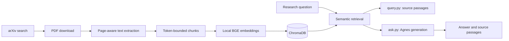

# Literature Review Engine

A Python prototype for discovering academic papers, indexing their text locally, finding relevant passages, and asking an Agnes-powered assistant questions about those passages.

The intended direction is a reproducible workflow for medical systematic and scoping reviews. The current version implements ingestion, retrieval, and retrieval-augmented generation (RAG). Review projects, historical search logs, screening decisions, and verified evidence tables are planned next.

## Current workflow



- `main.py` searches arXiv and indexes available PDFs.
- `query.py` retrieves passages with paper metadata and PDF page numbers.
- `ask.py` generates a short answer with source labels and prints the supporting passages.

Embeddings run locally using `BAAI/bge-small-en-v1.5`. Ingestion and retrieval require no LLM API key. Answer generation sends the question and retrieved passages to the configured Agnes API.

## Requirements and installation

Python 3.12 is recommended. An internet connection is needed for arXiv searches, PDF downloads, the first embedding-model download, and Agnes generation.

```bash
git clone https://github.com/hnt119/lit-rev-engine.git
cd lit-rev-engine
python3 -m venv .venv
source .venv/bin/activate
python -m pip install --upgrade pip
python -m pip install -r requirements.txt
```

On Windows, create and activate the environment with:

```powershell
py -3.12 -m venv .venv
.\.venv\Scripts\Activate.ps1
python -m pip install --upgrade pip
python -m pip install -r requirements.txt
```

For Command Prompt, use `.venv\Scripts\activate.bat` instead of the PowerShell activation command.

`requirements.txt` lists the direct runtime dependencies. `requirements-dev.txt` adds pytest. The previous complete environment freeze is retained as `requirements.lock.txt`; it is an optional constraints file, rather than a second list of packages to install:

```bash
python -m pip install -r requirements-dev.txt -c requirements.lock.txt
```

## Usage

### 1. Search and index papers

```bash
python main.py
```

Enter a keyword query when prompted. The default search limit is five papers. The pipeline downloads available PDFs, extracts text page by page, and creates chunks that fit the embedding model's token limit.

A failed download or unreadable PDF is reported and skipped. PDFs with no extractable text are skipped; scanned documents may require OCR. Empty searches and batches do not load the embedding model or clear the existing vector index.

### 2. Retrieve source passages

```bash
python query.py
```

Enter a focused research question. Results include the paper title, paper ID, chunk ID, vector distance, paper URL, PDF page number, local PDF path, and full retrieved passage when those fields are available.

Page numbers are one-based positions in the PDF file; they may differ from the page numbers printed in a journal article.

### 3. Generate an answer with Agnes

Copy `.env.example` to `.env` and set your key:

```dotenv
AGNES_API_KEY=your_key_here
AGNES_BASE_URL=https://apihub.agnes-ai.com/v1
AGNES_MODEL=agnes-2.0-flash
```

Then run:

```bash
python ask.py
```

The assistant uses up to `top_k` retrieved passages, asks Agnes to cite factual claims using `[Source 1]` labels, and shows the passages alongside the answer. Short passages are retained by default. If retrieval produces no usable passages, no generation request is made and no API key is needed.

The application rejects answers with missing or malformed source labels, labels referring to nonexistent sources, empty responses, and completions truncated by the token budget. Agnes can also return an explicit insufficient-evidence response.

**Citation validation checks labels, not whether each claim is supported.** Every generated claim and numerical result still needs verification in the original report. Nearest-neighbor retrieval returns the closest available passages even when the collection does not contain an answer.

`test_agnes.py` is a separate, optional live API smoke test:

```bash
python test_agnes.py
```

It sends an actual generation request and is excluded from the automated test suite.

## Configuration

`src/settings.py` is the shared configuration for ingestion, chunking, embeddings, retrieval, storage, and generation. `.env` is loaded from the repository root. Default data paths also resolve from the repository root, so changing the shell's working directory does not create a different index.

| Setting | Default | Purpose |
|---|---|---|
| `data_directory` | repository `data/` | Generated artifacts |
| `max_search_results` | `5` | Maximum arXiv results per ingestion |
| `chunk_size` | `300` | Word ceiling per chunk |
| `chunk_overlap` | `50` | Requested overlap in words |
| `embedding_model` | `BAAI/bge-small-en-v1.5` | Local embedding model |
| `top_k` | `5` | Retrieval and answer source limit |
| `chroma_directory` | `None` | Override index path; otherwise `data_directory/chroma` |
| `chroma_collection` | `research_chunks` | Chroma collection name |
| `max_source_distance` | `None` | Optional distance cutoff for answer sources |
| `max_tokens` | `5000` | Agnes completion token budget |
| `temperature` | `0.2` | Agnes generation temperature |

The tokenizer, including special tokens, determines the actual chunk length. A chunk may contain fewer than 300 words to fit the model. Overlap is reduced when necessary to ensure progress. Oversized embedding inputs are rejected instead of silently truncated; shorten unusually long research questions.

The default BGE model has a 512-token input limit. [BGE model documentation](https://huggingface.co/BAAI/bge-small-en-v1.5).

The index uses Chroma's L2 distance with normalized vectors. Lower distances indicate closer embeddings; distance is not a probability or evidence-quality score. Leave `max_source_distance=None` until a cutoff has been evaluated against your own corpus. A cutoff filters retrieved passages; it does not establish factual support.

## Repeated ingestion and existing indexes

Chunk IDs are deterministic within each arXiv report version. Re-ingesting a successfully parsed paper upserts its full chunk set and deletes obsolete chunk IDs after successful writes. Other indexed papers are retained. Do not pass partial paper chunk sets to `VectorStore.add_chunks()`; the method treats each supplied paper's chunks as its complete replacement set.

New collections record the embedding model. A different model cannot be used with that collection, even if its vector dimensions match. Set a new `chroma_collection` name and re-ingest when changing models.

Existing prototype indexes remain readable with the original BGE model. Legacy results may lack titles and page numbers, and their original embeddings may have been truncated. Re-ingest those papers to regenerate token-bounded chunks and provenance. Only papers returned by that ingestion are refreshed; other legacy papers remain in the collection. For a wholly refreshed corpus, choose a new collection and repeat the required searches.

Generated PDFs, chunks, and Chroma files are excluded from Git. Previously tracked generated files have been removed from Git tracking without deleting the local files. Cloning the repository creates a clean checkout; run ingestion to build your own index.

## Generated data

```text
data/
├── raw/arxiv_results.json             # Latest search metadata
├── pdfs/                             # Downloaded PDFs
├── processed/all_parsed.json         # Latest parsed papers and pages
├── chunks/all_chunks.json            # Latest chunks with provenance
├── embeddings/chunks_embedded.json   # Latest chunks with vectors
└── chroma/                           # Persistent aggregate vector index
```

JSON snapshots are UTF-8 and replaced atomically. Downloads are written to temporary files and moved into place after their PDF signature and document readability are checked; interrupted downloads do not become cached final files. Corrupt cached files are downloaded again.

**JSON outputs describe the latest run and are overwritten. They are not a historical search log.** The vector index accumulates papers across runs. Separate review projects and a persistent search ledger are not implemented yet.

Each new indexed chunk retains title, authors, publication date, arXiv entry URL, PDF URL, PDF path, PDF page number, and word offsets within that page. arXiv report versions remain distinct identifiers; record deduplication and linking multiple reports to one study are future work.

## Project structure

```text
src/
├── settings.py
├── search/arxiv_search.py
├── download/pdf_downloader.py
├── parser/pdf_parser.py
├── chunking/chunker.py
├── embeddings/embedder.py
├── vectorstore/chroma_store.py
├── retrieval/semantic_search.py
├── llm/agnes_generator.py
└── rag/rag_assistant.py
main.py
query.py
ask.py
test_agnes.py
tests/
```

PDF parsing uses PyMuPDF with sorted text extraction and standalone-heading detection. Recognized headings include abstract, introduction, methods, results, discussion, conclusion, and references. Section extraction remains heuristic; ingestion chunks page text and does not treat detected sections as verified evidence categories. Multi-column layouts, tables, figures, and scanned PDFs need further work.

## Automated tests

```bash
python -m pip install -r requirements-dev.txt
python -m pytest -q
```

For an explicitly offline run on macOS/Linux:

```bash
HF_HUB_OFFLINE=1 TRANSFORMERS_OFFLINE=1 python -m pytest -q
```

The suite uses temporary PDFs and Chroma databases, fake embeddings, and mocked network/generation responses. It covers token bounds and text coverage, page provenance, section detection, interrupted downloads, clean-directory ingestion, repeated indexing, stale-chunk removal, empty indexes, model mismatch, citation validation, truncated generation, configuration, and CLI import behavior. It does not call arXiv or Agnes or download a model.

## Medical systematic and scoping reviews

This prototype supports locating and reading evidence. Its arXiv-only, relevance-limited search does not provide comprehensive biomedical discovery or a reproducible review process.

The next development milestone is:

1. Persistent review projects, protocols, eligibility criteria, and exact search histories.
2. PubMed integration and imports of database exports such as RIS/BibTeX.
3. Citation-record deduplication and linkage of reports to underlying studies.
4. Title/abstract and full-text screening decisions, reviewer identity, exclusion reasons, and reconciled flow counts.
5. Structured extraction with source quotations, page/table locations, verification status, and design-appropriate appraisal.
6. Synthesis and exports based on verified evidence, with a medical-paper evaluation set.

PRISMA is a reporting guideline; implementing a flow diagram alone does not establish review quality. Systematic and scoping workflows should retain their distinct methodological requirements. [PRISMA 2020](https://www.prisma-statement.org/prisma-2020), [PRISMA-ScR](https://www.prisma-statement.org/scoping).

## Troubleshooting

- **No passages:** run ingestion first and check the configured collection/path. An empty index returns a useful message without loading a model.
- **Missing Agnes key:** create the root `.env` file. A key is needed only when a generation request is made.
- **Invalid citations:** the generated answer was rejected. Inspect retrieval results with `query.py` and retry with a more focused question.
- **Completion budget exhausted:** the partial answer was rejected. Reduce `top_k` or increase the configured token budget within your provider's limits.
- **Embedding input too long:** ingestion uses token-bounded chunks automatically; shorten an oversized query or use `Embedder.chunk_text()` when supplying documents programmatically.
- **Model mismatch:** choose a new collection and reindex with the selected model.
- **Legacy source locations missing:** re-ingest the original papers, or build a fresh collection.
- **Scanned or malformed PDF:** inspect the reported file; OCR and automatic repair are not implemented.

## License

No license has been added. Standard copyright restrictions apply until a license is supplied.
