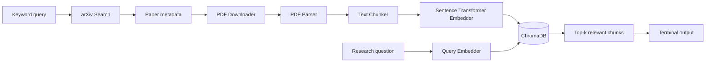
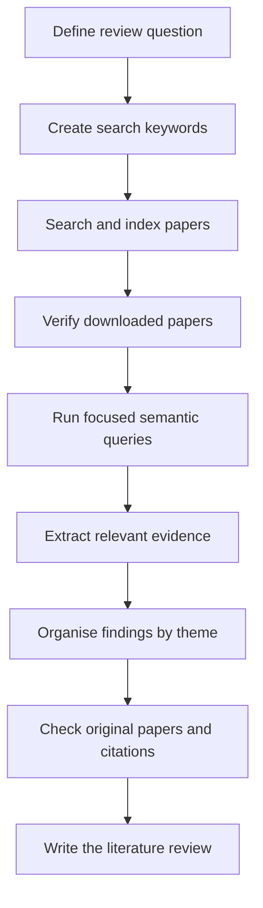

# Literature Review Engine

A local literature-search and semantic-retrieval pipeline for discovering academic papers, extracting their contents, and finding passages relevant to a research question.

The project currently supports:

- searching arXiv by keyword;
- downloading paper PDFs;
- extracting and cleaning PDF text;
- splitting papers into overlapping text chunks;
- generating sentence embeddings locally;
- storing embeddings in a persistent ChromaDB collection; and
- retrieving the most semantically relevant passages for a user query.

> **Project status:** early prototype. The current system performs document ingestion and semantic retrieval. It does not yet generate a final literature-review answer with an LLM.

---

## Architecture



The application is divided into two workflows.

### 1. Indexing workflow

Run `main.py` to create or extend the local research index:

```text
Keyword query
    ↓
Search arXiv
    ↓
Save paper metadata
    ↓
Download PDFs
    ↓
Extract and clean text
    ↓
Create overlapping chunks
    ↓
Generate embeddings
    ↓
Store chunks and embeddings in ChromaDB
```

### 2. Retrieval workflow

Run `query.py` after indexing papers:

```text
Research question
    ↓
Generate query embedding
    ↓
Search ChromaDB
    ↓
Return the top matching paper chunks
```

---

## Technology Stack

| Component | Technology |
|---|---|
| Paper search | `arxiv` |
| PDF download | `requests` |
| PDF parsing | PyMuPDF (`fitz`) |
| Text embeddings | Sentence Transformers |
| Default embedding model | `BAAI/bge-small-en-v1.5` |
| Vector database | ChromaDB |
| Tests | pytest |
| Language | Python |

All embeddings are generated locally. No API key is required for the current version.

---

## Project Structure

```text
lit-rev-engine/
├── data/
│   ├── raw/                 # arXiv search metadata
│   ├── pdfs/                # downloaded papers
│   ├── processed/           # parsed paper text
│   ├── chunks/              # text chunks
│   ├── embeddings/          # serialized embedded chunks
│   └── chroma/              # persistent ChromaDB data
│
├── src/
│   ├── search/
│   │   └── arxiv_search.py  # searches arXiv
│   ├── download/
│   │   └── pdf_downloader.py
│   ├── parser/
│   │   └── pdf_parser.py    # extracts, cleans, and sections PDF text
│   ├── chunking/
│   │   └── chunker.py       # creates overlapping word-based chunks
│   ├── embeddings/
│   │   └── embedder.py      # creates document and query embeddings
│   ├── vectorstore/
│   │   └── chroma_store.py  # persists and searches embeddings
│   └── retrieval/
│       └── semantic_search.py
│
├── tests/
│   └── chunker_test.py
├── main.py                  # indexing entry point
├── query.py                 # semantic-search entry point
├── requirements.txt
└── README.md
```

---

## Prerequisites

- Python 3.12 is recommended.
- Git is recommended for cloning the repository.
- An internet connection is required to search arXiv, download PDFs, and download the embedding model on first use.
- Several gigabytes of free disk space may be required, depending on the number of papers and Python packages installed.

---

## Installation

### Windows 10 — Command Prompt

```bat
git clone https://github.com/hnt119/lit-rev-engine.git
cd lit-rev-engine

py -3.12 -m venv .venv
.venv\Scripts\activate

python -m pip install --upgrade pip
pip install -r requirements.txt
```

### Windows 10 — PowerShell

```powershell
git clone https://github.com/hnt119/lit-rev-engine.git
cd lit-rev-engine

py -3.12 -m venv .venv
.\.venv\Scripts\Activate.ps1

python -m pip install --upgrade pip
pip install -r requirements.txt
```

If PowerShell prevents virtual-environment activation, run:

```powershell
Set-ExecutionPolicy -Scope Process -ExecutionPolicy Bypass
.\.venv\Scripts\Activate.ps1
```

### macOS or Linux

```bash
git clone https://github.com/hnt119/lit-rev-engine.git
cd lit-rev-engine

python3 -m venv .venv
source .venv/bin/activate

python -m pip install --upgrade pip
pip install -r requirements.txt
```

---

## Usage

### Step 1: Build the local paper index

```bash
python main.py
```

Enter a keyword query when prompted:

```text
Enter keyword query: gut microbiome reproductive health
```

The script currently retrieves up to five arXiv papers, downloads them, parses their text, creates embeddings, and stores the results in ChromaDB.

Generated files are stored under `data/`.

### Step 2: Search the indexed papers

```bash
python query.py
```

Enter a research question:

```text
Research question: How does the gut microbiome affect female reproductive health?
```

The program returns the five closest text chunks by default, including:

- paper ID;
- chunk ID;
- vector distance; and
- a preview of the retrieved text.

A lower distance generally indicates a closer semantic match.

---

## Using the Engine for a Literature Review

This project can support the **paper discovery and evidence-retrieval stages** of a literature review. It is best used as a local research assistant that helps you collect papers and quickly locate relevant passages within them.

It does not yet replace formal database searching, study screening, critical appraisal, citation management, or manual verification.

### Recommended Literature-Review Workflow



### Step 1: Define the Review Question

Start with a clear and specific review question.

For clinical or health-science topics, you may structure the question using frameworks such as:

- **PICO:** Population, Intervention, Comparison, Outcome
- **PEO:** Population, Exposure, Outcome
- **SPIDER:** Sample, Phenomenon of Interest, Design, Evaluation, Research type

Example:

```text
How is the gut microbiome associated with reproductive health outcomes in Asian women?
```

Break the question into key concepts:

```text
Population: Asian women
Exposure: gut microbiome
Outcome: reproductive health
```

### Step 2: Prepare Search Keywords

Create groups of synonyms for each concept.

Example:

```text
("Asian women" OR "women in Asia" OR Chinese OR Japanese OR Korean)
AND
("gut microbiome" OR "gut microbiota" OR intestinal microbiome)
AND
("reproductive health" OR fertility OR infertility OR PCOS OR endometriosis)
```

The current arXiv search is simpler than a full Boolean academic-database search. For the present version, run several focused keyword searches rather than relying on one very long search string.

Examples:

```text
Asian women gut microbiome reproductive health
```

```text
gut microbiome PCOS Asia
```

```text
intestinal microbiota endometriosis Asian women
```

```text
microbiome infertility China
```

For a formal review, save the exact search terms, databases, dates searched, filters, and numbers of records retrieved.

### Step 3: Index Papers

Activate the virtual environment, then run:

```bash
python main.py
```

Enter a focused search query when prompted:

```text
Enter keyword query: gut microbiome PCOS Asia
```

The indexing pipeline will:

1. search arXiv;
2. save paper metadata;
3. download available PDFs;
4. extract and clean the text;
5. divide the papers into overlapping chunks;
6. generate embeddings; and
7. save the chunks in ChromaDB.

The current implementation retrieves up to five papers per run.

To build a broader literature collection, run `main.py` several times with different keyword combinations.

Example:

```bash
python main.py
```

```text
Enter keyword query: Asian women gut microbiome
```

Then run it again:

```bash
python main.py
```

```text
Enter keyword query: microbiome PCOS Asia
```

Before indexing repeatedly, note that the current version may encounter duplicate ChromaDB IDs. If this occurs, rebuild the local vector database or add duplicate-handling logic before conducting a larger review.

### Step 4: Check the Collected Papers

Review the generated search metadata:

```text
data/raw/arxiv_results.json
```

Check:

- whether each paper is relevant to the review question;
- whether it is a primary study, review, conference paper, or preprint;
- whether it meets your date, population, language, and study-design criteria;
- whether the full PDF was downloaded successfully; and
- whether the same paper has already been collected.

Downloaded PDFs are stored in:

```text
data/pdfs/
```

Do not assume every retrieved paper should be included in the review. Search retrieval and study eligibility are separate stages.

### Step 5: Define Inclusion and Exclusion Criteria

Before screening, write clear eligibility criteria.

Example:

#### Inclusion criteria

```text
- Human studies involving women from Asian populations
- Studies examining gut or reproductive-tract microbiomes
- Studies reporting reproductive, fertility, gynaecological, or healthy-ageing outcomes
- Full-text papers available in English
- Original research published within the selected date range
```

#### Exclusion criteria

```text
- Animal-only or in-vitro studies
- Studies without an Asian population or subgroup
- Studies unrelated to women's reproductive health
- Editorials, commentaries, or conference abstracts without sufficient data
- Duplicate reports of the same study
```

Record the reason for excluding every full-text paper if you intend to produce a PRISMA flow diagram.

### Step 6: Search the Indexed Evidence

After papers have been indexed, run:

```bash
python query.py
```

Enter a focused research question:

```text
Research question: What microbiome changes are associated with PCOS in Asian women?
```

The engine returns the most semantically similar chunks from the indexed papers.

Useful query types include:

#### Background questions

```text
What is a healthy gut microbiome profile in Asian women?
```

#### Association questions

```text
Which bacterial taxa are associated with PCOS?
```

#### Mechanism questions

```text
How might gut dysbiosis contribute to insulin resistance in PCOS?
```

#### Comparison questions

```text
How do microbiome profiles differ between women with endometriosis and healthy controls?
```

#### Methods questions

```text
Which sequencing methods were used to characterise the microbiome?
```

#### Evidence-gap questions

```text
What limitations are commonly reported in studies of Asian women's microbiomes?
```

Use several narrow questions instead of one broad request such as:

```text
Tell me everything about the microbiome.
```

Focused questions usually produce more useful retrieval results.

### Step 7: Review the Retrieved Chunks

For each result, record:

- paper ID;
- chunk ID;
- relevance to the review question;
- main finding;
- population;
- sample size;
- study design;
- exposure or intervention;
- outcome;
- limitations; and
- the location of the evidence in the original paper.

A simple evidence-extraction table may look like this:

| Paper | Population | Study design | Microbiome site | Main finding | Limitations | Include? |
|---|---|---|---|---|---|---|
| Paper A | Chinese women with PCOS | Cross-sectional | Gut | Reduced microbial diversity | Small sample | Yes |
| Paper B | Japanese healthy adults | Cohort | Gut | Diet associated with enterotype | Not specific to reproductive disease | Background only |

The semantic-search output should be treated as a **lead to relevant evidence**, not as the final evidence record.

### Step 8: Verify Every Finding in the Original PDF

Always open the source PDF before using a retrieved passage in your review.

Check:

- whether the chunk preserves the original meaning;
- whether the finding applies to the correct population;
- whether the result was statistically significant;
- whether it came from the results section rather than the discussion;
- whether the authors are reporting their own data or citing another study;
- whether important qualifications were omitted during chunking; and
- whether the paper is a preprint or peer-reviewed publication.

Do not cite the generated JSON files or ChromaDB output as academic sources. Cite the original paper.

### Step 9: Organise Findings by Theme

After evidence extraction, group studies into review sections.

For example:

```text
1. Healthy microbiome profiles in Asian women
2. Determinants of the microbiome
   - diet
   - geography
   - medication
   - age
   - hormones
3. Microbiome and reproductive health
4. Microbiome in gynaecological disease
   - PCOS
   - endometriosis
   - infertility
   - premature ovarian insufficiency
5. Microbiome and healthy ageing
6. Methodological limitations
7. Research gaps and future directions
```

Run separate semantic queries for each section.

Examples:

```text
What dietary factors shape the gut microbiome in Asian women?
```

```text
What microbiome features are reported in women with endometriosis?
```

```text
What are the major methodological limitations across these studies?
```

### Step 10: Maintain a Search Log

For a reproducible review, maintain a search log outside the application.

| Date | Source | Search query | Filters | Results retrieved | Notes |
|---|---|---|---|---:|---|
| 23 Jul 2026 | arXiv | Asian women gut microbiome | None | 5 | Indexed locally |
| 23 Jul 2026 | arXiv | microbiome PCOS Asia | None | 5 | Two possible duplicates |

The current application overwrites `data/raw/arxiv_results.json` on each run. Therefore, copy or rename the file after each search if you need a complete historical search record.

Example:

#### Windows

```bat
copy data\raw\arxiv_results.json data\raw\arxiv_results_pcos_2026-07-23.json
```

#### macOS or Linux

```bash
cp data/raw/arxiv_results.json data/raw/arxiv_results_pcos_2026-07-23.json
```

### Step 11: Use the Results with PRISMA

The engine can assist with identifying and reviewing papers, but PRISMA counts must still be tracked deliberately.

Record:

```text
Records identified
Records removed as duplicates
Records screened by title and abstract
Records excluded
Full-text reports assessed
Full-text reports excluded, with reasons
Studies included in the final review
```

A suggested workflow is:

```text
Search databases
    ↓
Export all records
    ↓
Deduplicate records
    ↓
Screen titles and abstracts
    ↓
Retrieve full texts
    ↓
Index eligible or potentially eligible PDFs
    ↓
Use semantic search for evidence extraction
    ↓
Complete full-text eligibility assessment
    ↓
Include final studies
```

For a formal systematic review, do not use arXiv alone. Search appropriate databases such as PubMed/MEDLINE, Embase, Scopus, Web of Science, PsycINFO, or discipline-specific databases where relevant.

### Step 12: Write the Review

Use the retrieved and verified evidence to compare studies rather than summarising each paper separately.

Weak synthesis:

```text
Study A found X. Study B found Y. Study C found Z.
```

Stronger synthesis:

```text
Across small cross-sectional studies, PCOS was generally associated with altered gut microbial diversity, although the specific taxa differed between populations and sequencing methods. These inconsistencies may reflect dietary, geographical, and methodological heterogeneity.
```

Every factual statement should be checked against the original paper and cited using your required citation style.

---

## Example End-to-End Session

### 1. Build the index

```bash
python main.py
```

```text
Enter keyword query: gut microbiome PCOS Asian women
```

### 2. Ask a focused question

```bash
python query.py
```

```text
Research question: Which gut microbial changes are associated with PCOS in Asian women?
```

### 3. Record useful results

For each relevant result:

```text
Paper ID:
Chunk ID:
Claim:
Population:
Study design:
Key result:
Limitation:
Needs verification:
```

### 4. Open the original paper

Confirm the result in the PDF stored under:

```text
data/pdfs/
```

### 5. Add the verified finding to an evidence table

Only after checking the source should the finding be used in the written review.

---

## What the Engine Can and Cannot Do

### It can help with

- discovering a small set of arXiv papers;
- downloading and organising PDFs;
- locating passages relevant to a research question;
- finding recurring concepts across papers;
- identifying possible themes and evidence gaps;
- accelerating evidence extraction; and
- supporting narrative or scoping-review preparation.

### It cannot yet reliably do

- comprehensive systematic database searching;
- automatic Boolean search translation;
- robust deduplication;
- title and abstract screening;
- risk-of-bias assessment;
- study-quality appraisal;
- automatic PRISMA accounting;
- accurate page-level citation generation;
- final claim verification;
- reference-manager synchronisation; or
- fully grounded literature-review writing.

Human review remains essential.

## Running Tests

```bash
pytest -v
```

The current test suite focuses on the chunking logic, including chunk size, overlap, empty input, and invalid parameter handling.

---

## Data Flow

### Search metadata

arXiv results are saved to:

```text
data/raw/arxiv_results.json
```

Each result includes fields such as title, authors, abstract, publication date, PDF URL, and arXiv entry ID.

### Parsed papers

Cleaned text and basic section detection are saved to:

```text
data/processed/all_parsed.json
```

The parser currently attempts to identify:

- introduction;
- methods or methodology;
- results or experiments; and
- conclusion.

Section detection is heuristic and may not work reliably for every PDF layout.

### Chunks

Text is split into overlapping word-based chunks and saved to:

```text
data/chunks/all_chunks.json
```

Default chunking parameters:

```text
chunk size: 300 words
overlap:     50 words
```

### Embeddings and vector storage

Serialized embedded chunks are saved to:

```text
data/embeddings/chunks_embedded.json
```

The searchable vector index is persisted in:

```text
data/chroma/
```

The ChromaDB collection is named:

```text
research_chunks
```

---

## Module Responsibilities

| Module | Responsibility |
|---|---|
| `search_arxiv()` | Finds papers using arXiv relevance search |
| `download_many()` | Downloads available paper PDFs |
| `parse_pdf()` | Extracts, cleans, and roughly structures PDF text |
| `chunk_text()` | Splits text into overlapping chunks |
| `Embedder` | Embeds chunks and research questions |
| `VectorStore` | Adds embeddings to and queries ChromaDB |
| `SemanticSearcher` | Coordinates query embedding and vector retrieval |
| `main.py` | Runs the complete indexing pipeline |
| `query.py` | Runs interactive semantic retrieval |

---

## Current Limitations

- Only arXiv is searched; PubMed, Crossref, Semantic Scholar, and other databases are not yet integrated.
- The system indexes only the first five search results unless the code is changed.
- PDF parsing is text-based and may struggle with multi-column layouts, tables, figures, equations, or scanned PDFs.
- Section detection relies on simple heading matching.
- Chunking is based on word count rather than document structure or tokens.
- Re-running ingestion may attempt to add records with IDs already present in the Chroma collection.
- Retrieval returns passages but does not synthesize an answer, cite claims, screen papers, remove duplicates, or assess study quality.
- Metadata stored with each vector is currently limited to `paper_id` and `chunk_id`.
- The current requirements file is a full environment freeze and is larger than a minimal production dependency list.

---

## Recommended Next Steps

1. **Add retrieval-augmented generation**  
   Pass retrieved chunks to an LLM and generate an answer grounded in the source passages.

2. **Improve citation metadata**  
   Store paper title, authors, year, URL, page number, and section with every chunk.

3. **Separate commands cleanly**  
   Introduce a CLI such as:

   ```bash
   python -m litrev ingest "query"
   python -m litrev search "research question"
   ```

4. **Prevent duplicate indexing**  
   Use deterministic document IDs and upsert existing Chroma records.

5. **Improve academic search coverage**  
   Add PubMed and Crossref connectors, especially for biomedical literature reviews.

6. **Improve PDF parsing**  
   Preserve page numbers, headings, references, and layout-aware text.

7. **Add filtering and screening**  
   Support date ranges, inclusion criteria, deduplication, and PRISMA-compatible exports.

8. **Expand tests**  
   Add unit and integration tests for search, parsing, embeddings, storage, and retrieval.

9. **Add a user interface**  
   Build a lightweight Streamlit, FastAPI, or web interface for non-technical users.

---

## Troubleshooting

### `ModuleNotFoundError`

Make sure you are inside the repository root and the virtual environment is active:

```bash
python main.py
```

Do not run the file from inside one of the `src/` subdirectories.

### The first run is slow

Sentence Transformers downloads the embedding model during its first use. Later runs should use the local model cache.

### No query results are returned

Run `python main.py` first so that the ChromaDB collection contains indexed chunks.

### ChromaDB reports duplicate IDs

Delete the existing local index and rebuild it:

#### Windows

```bat
rmdir /s /q data\chroma
python main.py
```

#### macOS or Linux

```bash
rm -rf data/chroma
python main.py
```

This removes the vector index but not the downloaded PDFs or JSON outputs.

### A PDF fails to download

The downloader skips failed papers and continues processing the remaining results. Check the terminal output and your internet connection.

---

## Development Notes

The repository currently uses two top-level scripts:

- `main.py` for ingestion and indexing;
- `query.py` for retrieval.

Keeping these workflows separate is useful because paper processing is relatively expensive, while query retrieval is fast once the ChromaDB index has been built.

For development, run the tests before committing changes:

```bash
pytest -v
```

---

## Roadmap

The intended evolution of the project is:

```text
Semantic retrieval
    ↓
Grounded answer generation
    ↓
Structured evidence extraction
    ↓
Paper screening and deduplication
    ↓
Citation management
    ↓
PRISMA-compatible literature-review workflow
```

---

## License

No license has been added yet. Until a license is provided, standard copyright restrictions apply.
