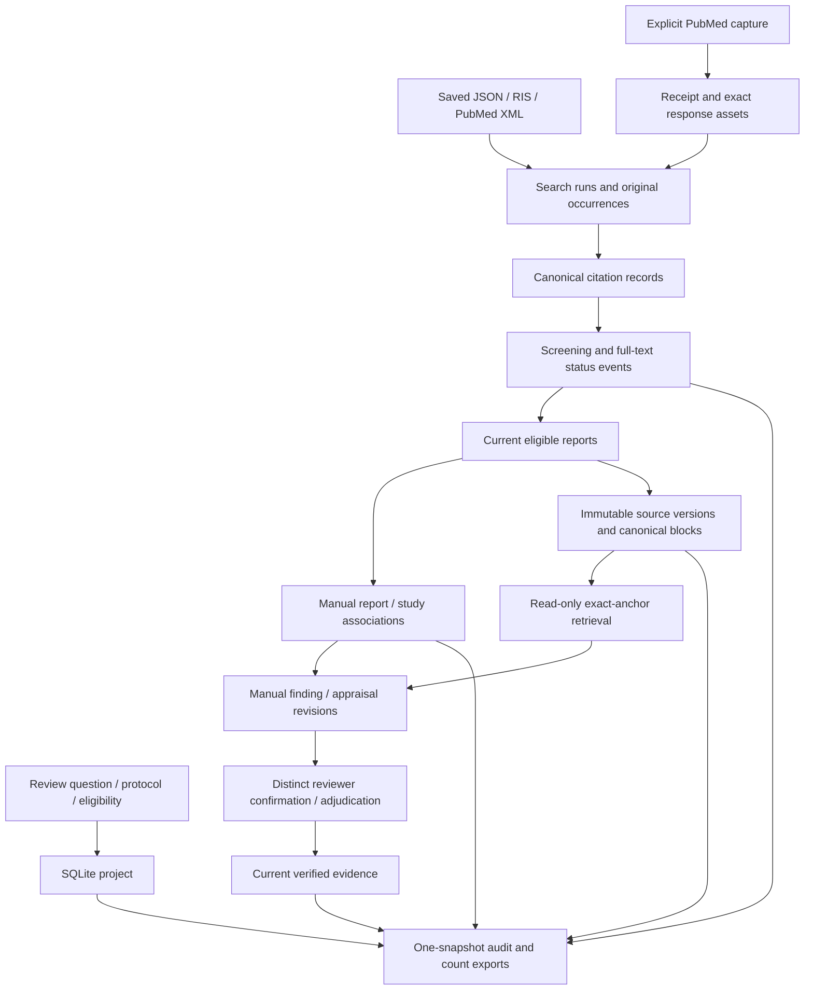

# Architecture and repository map

This guide describes the current code. The [cloud model strategy](model-strategy.md) is a proposed integration, with separate acceptance gates. The next product milestone remains a small protocol-defined review with human reviewers; see the [roadmap](review-roadmap.md).

## Choose the right entry point

| Entry point | Purpose | Persistent state | Inference |
| --- | --- | --- | --- |
| `review.py` | Systematic/scoping project, search/import provenance, screening, study links, source/evidence history, counts and exports | SQLite ledger, including retained source and capture bytes | Exact lexical passage retrieval; no embedding or generation dependency |
| `main.py` | Search arXiv, download and index PDF passages | Downloaded PDFs/chunks and a Chroma index | Local Sentence Transformers embeddings |
| `query.py` | Explore passages in that Chroma index | Reads the index | Local embeddings; no generation key |
| `ask.py` | Ask the optional passage assistant | Reads the index; outputs answer/source passages | Local embeddings plus configured Agnes chat API |

The exploration pipeline does not create review projects, screening decisions, study links or verified findings. Its citation-label checks validate source references in an answer, rather than semantic entailment or clinical validity. Real review evidence enters the ledger through exact source quotations and explicit human verification.

## Current review data flow

Citation identity uses conservative DOI/PMID matching and a limited exact fallback; it does not establish study identity. Each report can relate to multiple studies and each study can have multiple reports. Incomplete study association keeps the final included-study count null. Screening, source changes and unresolved associations determine whether an evidence revision is eligible for the current verified export.

## Files and responsibilities

| File or directory | Responsibility |
| --- | --- |
| `src/review/cli.py` | CLI parsing, errors and JSON responses; `--db` precedes the command |
| `src/review/store.py` | ReviewStore persistence, transactions, source reads and public operations |
| `src/review/models.py`, `importers.py`, `identity.py` | Import specifications, strict bibliography parsing and conservative record matching |
| `src/review/studies.py` | Study inventory and complete per-reviewer association sets |
| `src/review/documents.py` | Canonical TXT/JATS/PDF blocks, parser provenance and own-identifier checks |
| `src/review/evidence.py` | Hashed evidence revisions, quotation validation and verification eligibility |
| `src/review/retrieval.py` | Current project/source/scope checks, BM25/overlap scoring and exact-anchor traces |
| `src/review/exporters.py` | Reconciled counts and current/audit exports from one snapshot |
| `src/search/pubmed_search.py` | Explicit search capture, membership verification and offline capture import |
| `src/settings.py` | Exploration pipeline configuration and optional Agnes settings |
| `src/embeddings`, `src/vectorstore`, `src/retrieval/semantic_search.py` | Local embeddings and separate Chroma passage search |
| `src/rag`, `src/llm` | Optional source-labelled passage generation |
| `examples/review` | Invented imports for the beginner guide |
| `tests` | Unit and independent acceptance cases using temporary data/mocked services |
| `tests/fixtures/medical_*`, `tools/evaluate_medical_retrieval*` | Licensed, frozen source/gold evaluation and prospective selection/repair guards |
| `docs` | Usage, interfaces, evaluations, accepted limitations and next tickets |

## Stored data and reproducibility

The default review database is `data/reviews.sqlite3`; use an explicit `--db` path to isolate projects or demos. It preserves history and retained bytes. Back up the database through a consistent SQLite backup or with its connection closed; account for active WAL files when copying a live database. Export is a readable audit bundle and is not an implemented database-restoration command.

The passage pipeline's downloaded PDFs, chunks and Chroma files live under `data/` and are ignored by Git. It keeps the embedding model name in collection metadata and rejects mismatched models. Changing the embedding model requires a new collection and complete reindexing. Future cloud profiles must also pin revision, instructions, tokenizer, output dimension, normalization and distance metric; see the [model plan](model-strategy.md).

Project retrieval reads a consistent SQLite snapshot. Its trace includes query, scope, method/version/parameters, selected source manifests and exact half-open Unicode anchors. Context used to rank a passage remains separately anchored and cannot replace that passage's own evidence quotation. The existing methods and frozen results remain versioned.

CSV exports escape spreadsheet formula prefixes; JSON retains exact input text. Separate output files are replaced individually, so an export directory is not an atomic transaction. Read the [starter guide](getting-started.md) for a deterministic unchanged-ledger export example.

## Boundaries to retain during the pilot

The review CLI records declared reviewer identities without authentication or enforced reviewer quorum. It has explicit current conflict/verification rules but limited stage reopening. PubMed capture is bounded to 10,000 matches and tested against synthetic responses; comprehensive search design remains protocol work. Scanned PDFs need a separately verified OCR workflow. The three-source v3 retrieval pilot passes its fixed support gate while leaving three incomplete answers and weak no-answer context recovery.

Cloud inference should be optional and keep these same source/scope/history boundaries. An endpoint failure must not remove screening decisions or rewrite verified evidence. Generated text may become a proposed extraction only after exact-anchor validation and explicit review; model scores cannot establish eligibility or clinical truth.

## Validation and next milestone

The accepted engine release passed 1,240 tests and 31 subtests, with seven source/gold checkers. For local regression, install `requirements-dev.txt` and run `python -m pytest -q`. The ledger starter guide itself needs only Python 3.12 and uses invented records. Model-card specifications are research evidence; no recommended cloud model has yet been benchmarked by this repository.

The next milestone uses a real review team's question, search strategy, eligibility rules and extraction form. Preserve independent original decisions, reconcile disagreements and report missing support. Build only the workflow fixes that pilot demonstrates. The [roadmap](review-roadmap.md) separates Implementation, Retrieval and Evaluation acceptance.
