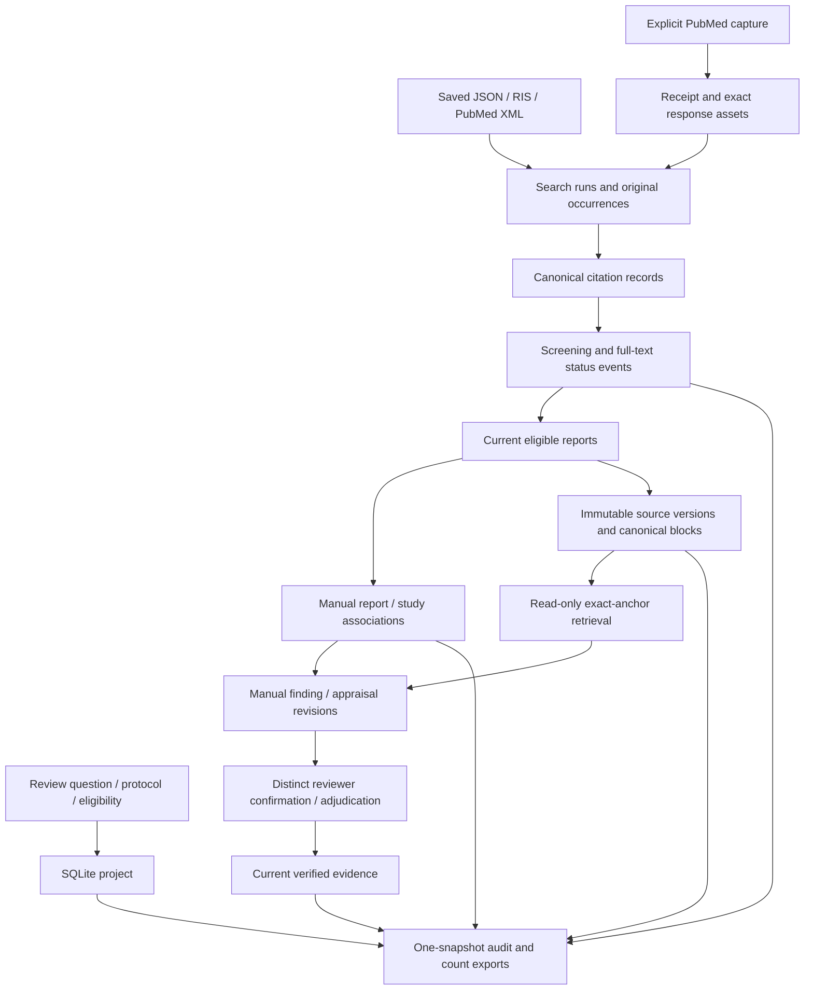

# Architecture and repository map

This guide describes the current code. The [Qwen workflow](qwen-cloud.md) adds optional free Kaggle batch retrieval with [separate acceptance gates](qwen-kaggle-milestone.md). The user placed this integration before the small protocol-defined human review; see the [roadmap](review-roadmap.md).

## Choose the right entry point

| Entry point | Purpose | Persistent state | Inference |
| --- | --- | --- | --- |
| `review.py` | Systematic/scoping project, search/import provenance, screening, study links, source/evidence history, counts and exports | SQLite ledger, including retained source and capture bytes | Offline lexical retrieval; `qwen-export`/`qwen-import` prepare and validate external Kaggle GPU jobs; historical paid transport requires explicit opt-in |
| `review_components.py` | Experimental component-aware source jobs and result import; delegates existing commands | Same SQLite ledger plus separate immutable job/result/receipt artifacts | Free finite Kaggle batch; local export/import/replay |
| `main.py` | Search arXiv, download and index PDF passages | Downloaded PDFs/chunks and a Chroma index | Local Sentence Transformers embeddings |
| `query.py` | Explore passages in that Chroma index | Reads the index | Local embeddings; no generation key |
| `ask.py` | Ask the optional passage assistant | Reads the index; outputs answer/source passages | Local embeddings plus configured Agnes chat API |

The exploration pipeline does not create review projects, screening decisions, study links or verified findings. Its citation-label checks validate source references in an answer, rather than semantic entailment or clinical validity. Real review evidence enters the ledger through exact source quotations and explicit human verification.

## Current review data flow

Citation identity uses conservative DOI/PMID matching and a limited exact fallback; it does not establish study identity. Each report can relate to multiple studies and each study can have multiple reports. Incomplete study association keeps the final included-study count null. Screening, source changes and unresolved associations determine whether an evidence revision is eligible for the current verified export.

## Files and responsibilities

| File or directory | Responsibility |
| --- | --- |
| `src/review/cli.py` | CLI parsing, errors and JSON responses; `--db` precedes the command |
| `src/review/store.py` | ReviewStore persistence, transactions, source reads and public operations |
| `src/review/models.py`, `importers.py`, `identity.py` | Import specifications, strict bibliography parsing and conservative record matching |
| `src/review/studies.py` | Study inventory and complete per-reviewer association sets |
| `src/review/documents.py` | Canonical TXT/JATS/PDF blocks, parser provenance and own-identifier checks |
| `src/review/evidence.py` | Hashed evidence revisions, quotation validation and verification eligibility |
| `src/review/retrieval.py` | Current project/source/scope checks, BM25/overlap scoring and exact-anchor traces |
| `src/review/qwen_batch.py`, `qwen_cli.py` | Offline immutable source jobs, local result validation/replay and CLI delegation to the frozen ledger commands |
| `tools/qwen_kaggle_runner.py`, `notebooks/qwen_kaggle.ipynb` | Standalone free GPU batch worker: pinned weights, sequential embedding/reranking, token and runtime receipts |
| `src/review_components/` | Separate component profile, shared standalone allocation/selection math, read-only ledger adapter and new CLI |
| `tools/qwen_components_kaggle_runner.py`, `tools/qwen_kaggle_environment.py`, `notebooks/qwen_components_kaggle.ipynb` | New worker and isolated package installer; hash-bound executable bundle and dependency/CUDA preflight |
| `tools/evaluate_qwen_components.py`, `tests/fixtures/qwen_components_*` | Separate prospective development/confirmation sources, truth, matched comparators and grading |
| `src/review/qwen.py`, `cloud_retrieval.py` | Historical native paid transport and saved-response replay; no default paid invocation |
| `src/review/exporters.py` | Reconciled counts and current/audit exports from one snapshot |
| `src/search/pubmed_search.py` | Explicit search capture, membership verification and offline capture import |
| `src/settings.py` | Exploration pipeline configuration and optional Agnes settings |
| `src/embeddings`, `src/vectorstore`, `src/retrieval/semantic_search.py` | Local embeddings and separate Chroma passage search |
| `src/rag`, `src/llm` | Optional source-labelled passage generation |
| `examples/review` | Invented imports for the beginner guide |
| `tests` | Unit and independent acceptance cases using temporary data/mocked services |
| `tests/fixtures/medical_*`, `tools/evaluate_medical_retrieval*` | Licensed, frozen source/gold evaluation and prospective selection/repair guards |
| `docs` | Usage, interfaces, evaluations, accepted limitations and next tickets |

## Stored data and reproducibility

The default review database is `data/reviews.sqlite3`; use an explicit `--db` path to isolate projects or demos. It preserves history and retained bytes. Back up the database through a consistent SQLite backup or with its connection closed; account for active WAL files when copying a live database. Export is a readable audit bundle and is not an implemented database-restoration command.

The passage pipeline's downloaded PDFs, chunks and Chroma files live under `data/` and are ignored by Git. It keeps the embedding model name in collection metadata and rejects mismatched models. Changing the embedding model requires a new collection and complete reindexing. Future cloud profiles must also pin revision, instructions, tokenizer, output dimension, normalization and distance metric; see the [model plan](model-strategy.md).

Qwen batch retrieval exports a hashed project/source/scope snapshot and questions while keeping the ledger local. The Kaggle notebook downloads immutable Hugging Face model revisions, records full token lengths without truncation and loads one FP16 model at a time. Local import reconstructs dense/lexical fusion and ranks, validates every returned identity/value and rechecks current state before publishing an immutable receipt. Changed source/eligibility/linkage/profile invalidates the job. Saved results replay offline with trusted original hashes. GPU runtime metadata documents execution; it is not remote attestation. Ledger export does not include these external artifacts. Historical DeepInfra aliases and setup failures remain documented separately.

The [component profile](qwen-components-contract-v1.md) accepts a whole question and zero, two or three reviewer-declared parts. It reserves each part's first two hybrid candidates, fills one shared pool of twenty, then selects each part's highest-scoring block before filling five display places by whole-question score. Shared passages occupy one place and retain every selection reason. The uploaded standalone core and local importer use identical pinned bytes. Report grouping adds no passages or inferred study relationships. Whole-query Qwen, whole-query lexical and component lexical traces remain separate comparisons; a selection reason is not proof of semantic support. The [workflow guide](qwen-components-guide.md) describes the separate commands and package isolation.

Project retrieval reads a consistent SQLite snapshot. Its trace includes query, scope, method/version/parameters, selected source manifests and exact half-open Unicode anchors. Context used to rank a passage remains separately anchored and cannot replace that passage's own evidence quotation. The existing methods and frozen results remain versioned.

CSV exports escape spreadsheet formula prefixes; JSON retains exact input text. Separate output files are replaced individually, so an export directory is not an atomic transaction. Read the [starter guide](getting-started.md) for a deterministic unchanged-ledger export example.

## Boundaries to retain during the pilot

The review CLI records declared reviewer identities without authentication or enforced reviewer quorum. It has explicit current conflict/verification rules but limited stage reopening. PubMed capture is bounded to 10,000 matches and tested against synthetic responses; comprehensive search design remains protocol work. Scanned PDFs need a separately verified OCR workflow. The three-source v3 retrieval pilot passes its fixed support gate while leaving three incomplete answers and weak no-answer context recovery.

Cloud inference should be optional and keep these same source/scope/history boundaries. An endpoint failure must not remove screening decisions or rewrite verified evidence. Generated text may become a proposed extraction only after exact-anchor validation and explicit review; model scores cannot establish eligibility or clinical truth.

## Validation and next milestone

The accepted foundation release passed 1,240 tests and 31 subtests, with seven source/gold checkers; the historical Qwen software release passed 1,545 tests and 31 subtests. The component software checkout passed 1,771 tests and 31 subtests. For local regression, install `requirements-dev.txt` and run `python -m pytest -q`. The ledger starter guide itself needs only Python 3.12 and uses invented records. The [first measured free-GPU Qwen run](qwen-kaggle-run-v2.md) completed but failed its fixed quality gate. The [component evaluation](qwen-components-evaluation.md) records source/software acceptance; the [separate run record](qwen-components-runs-v1.md) tracks actual cloud progress and current limitations.

The next milestone uses a real review team's question, search strategy, eligibility rules and extraction form. Preserve independent original decisions, reconcile disagreements and report missing support. Build only the workflow fixes that pilot demonstrates. The [roadmap](review-roadmap.md) separates Implementation, Retrieval and Evaluation acceptance.
