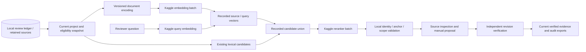

# Cloud model strategy for the review engine

Research checked **4 October 2026, Asia/Singapore**. The user wants compute-heavy inference in the cloud and has requested Qwen integration before the human pilot. The user declined paid inference, so the recommended serving route is now a finite free Kaggle GPU notebook: [Qwen workflow](qwen-cloud.md), [Kaggle contract](kaggle-provider-contract.md) and [acceptance milestone](qwen-kaggle-milestone.md). The earlier paid adapter remains opt-in only; its setup produced no ranked result. Existing defaults and frozen medical evaluations remain unchanged. CPU checks and actual GPU quality evidence must be read separately.

## Decision

The implemented optional pair is **Qwen3-Embedding-4B and Qwen3-Reranker-4B**, using immutable batch source jobs, recorded vectors/scores and locally reconstructed candidate pools. Compare the 8B pair only if measured support completeness justifies its latency and cost. Keep the existing BGE-small passage pipeline and exact-anchor lexical project retrieval as explicit baselines.

Author model-card benchmarks use other tasks and protocols. The engine's fresh v3 pilot already exposes incomplete multi-block support and misleading candidates on no-answer questions; relevance scores cannot establish an answer or verify a finding. The first actual [Qwen Kaggle evaluation](qwen-kaggle-run-v2.md) improves own-support coverage from 72.2% to 80.6% and complete positives from 2/6 to 4/6, but fails the fixed 85% gate. The 4B pair fits a Tesla T4 in this measured finite batch. Missing companion paragraphs occur both before and after reranking, so the next priority is component coverage, before a larger-model comparison. Any changed method needs fresh prospective confirmation. The user placed the [Qwen acceptance gate](qwen-kaggle-milestone.md) before the [human review pilot](pilot-milestone.md).

## Current code and concrete integration gaps

`src/settings.py` selects `BAAI/bge-small-en-v1.5` for the separate passage exploration pipeline. `src/embeddings/embedder.py` applies normalized `SentenceTransformer.encode()` to both queries and documents. `src/vectorstore/chroma_store.py` checks only the embedding model name in collection metadata. The new Qwen batch module provides stdlib source export and local result validation; they do not reuse or alter that Chroma collection. Agnes remains a separate generation transport.

The BGE-small card describes a 33.4M-parameter, 384-dimensional, 512-token encoder with an MIT license. It permits instruction-free v1.5 use and recommends a query instruction for short-query passage retrieval. A prompted baseline would therefore be a separately recorded experiment, not an invisible change. [BGE-small model card](https://huggingface.co/BAAI/bge-small-en-v1.5).

`review.py` and `src/review/retrieval.py` remain independent of these models. They preserve local SQLite history, selected-source integrity and exact canonical quotation anchors. A new model must fit those boundaries rather than send a whole ledger to a generator.

## Shortlist from primary model cards

| Candidate | Useful published specification | Role and integration tradeoff |
| --- | --- | --- |
| [Qwen3-Embedding-4B](https://huggingface.co/Qwen/Qwen3-Embedding-4B) + [Qwen3-Reranker-4B](https://huggingface.co/Qwen/Qwen3-Reranker-4B) | Apache 2.0; 32K context; embedding up to 2,560 dimensions | Primary cloud candidate. Use the prescribed query instruction and unprefixed documents. Reranking has a separate pair-scoring contract. |
| [Qwen3-Embedding-8B](https://huggingface.co/Qwen/Qwen3-Embedding-8B) + [Qwen3-Reranker-8B](https://huggingface.co/Qwen/Qwen3-Reranker-8B) | Apache 2.0; 32K context; embedding up to 4,096 dimensions | Larger comparison under the same frozen data and budgets. A larger model is not a selection criterion by itself. |
| [Jina embeddings v5-text-small](https://huggingface.co/jinaai/jina-embeddings-v5-text-small) + [Jina reranker v3.5](https://huggingface.co/jinaai/jina-reranker-v3.5) | 2026 releases; 677M embedding, 32K context, 1,024 dimensions; listwise reranker | Newer efficiency candidate. Published weights use CC BY-NC 4.0; managed API/commercial terms are separate. Self-hosting uses custom code and task-specific encoding. |
| [BGE-M3](https://huggingface.co/BAAI/bge-m3) + [BGE reranker-v2-m3](https://huggingface.co/BAAI/bge-reranker-v2-m3) | Smaller family; M3 embedding 8,192 tokens and 1,024 dimensions; embedding MIT, reranker Apache 2.0 | Simpler cost comparison. Dense use fits a single-vector index; sparse/multivector use requires different indexing support. Configure the reranker token budget explicitly. |
| [MedCPT query](https://huggingface.co/ncbi/MedCPT-Query-Encoder), [article](https://huggingface.co/ncbi/MedCPT-Article-Encoder) and [cross encoder](https://huggingface.co/ncbi/MedCPT-Cross-Encoder) | Biomedical retrieval; separate query/article encoders; 768-dimensional vectors; public-domain cards | Title/abstract discovery comparator. Its article encoding contract does not establish full-text/table support and cannot use the same encoder on both sides. |
| [Nemotron embed-1B-v2](https://huggingface.co/nvidia/llama-nemotron-embed-1b-v2) + [rerank-1B-v2](https://huggingface.co/nvidia/llama-nemotron-rerank-1b-v2) | 1B class; embedding up to 2,048 dimensions and 8,192 tokens | Secondary NVIDIA serving option. Distinct license notices, custom code and query/passage formatting add integration work. |

The Qwen embedding card documents separate query prompting, pooling and normalization, and the reranker card documents both CrossEncoder and yes/no scoring approaches. Token counts must include formatting and instructions. The model's advertised context ceiling is not the deployed endpoint's actual accepted budget; example scripts can use smaller limits. [Embedding usage](https://huggingface.co/Qwen/Qwen3-Embedding-4B#usage), [reranker usage](https://huggingface.co/Qwen/Qwen3-Reranker-4B#usage).

This is a selected shortlist, not an exhaustive current leaderboard. Medical branding, general benchmark averages and larger parameter counts do not demonstrate exact-source support completeness on this repository's tasks.

## Cloud serving choices

For this pilot, use the [free Kaggle batch workflow](qwen-cloud.md). The notebook downloads public, ungated Hugging Face checkpoints at immutable revisions, runs one FP16 model at a time and returns saved numeric results. The Mac performs source validation and replay. No paid inference API is needed. Check the account's available GPU/quota and actual memory fit; general platform specifications do not establish those facts. The [Kaggle contract](kaggle-provider-contract.md) records official sources and remaining uncertainties.

Managed DeepInfra and dedicated Hugging Face endpoints remain possible later serving options, but they are outside the current no-spend workflow. The existing [DeepInfra contract](qwen-provider-contract.md) and unsuccessful setup receipts are historical evidence. Model inputs, revisions, tokenizer/encoding rules, runtime versions, actual token lengths, elapsed time and peak Torch allocation are recorded in the batch artifacts. Saved vectors/scores reproduce local ranking without requiring future GPU calculations to be bitwise identical.

## Proposed architecture

The retrieval stages are available through `review.py qwen-export`, the Kaggle notebook and `review.py qwen-import`; the final manual review/verification stages use the existing ledger commands. Local project state remains authoritative. Send the permitted query/candidate paper text to cloud inference; retain reviewer identities, adjudication and verification in the ledger. A model can rank existing candidates but cannot replace their text, invent block IDs, change screening decisions or confirm its own extraction.

Cloud latency should not hold a database write transaction open. Capture the source/eligibility manifest first, then validate that the same versions and states remain current when the response arrives. A changed source or scope invalidates that result. Record an unavailable endpoint explicitly; any lexical fallback must expose its actual method rather than masquerade as the selected cloud method.

## Proposed interfaces and index provenance

| Interface | Required behavior |
| --- | --- |
| `embed_query(query, profile)` | Apply the recorded query instruction; validate token budget including formatting; return finite vectors, dimension and actual provider/model metadata. |
| `embed_documents(passages, profile)` | Preserve candidate ordering and identity; use the recorded document encoding and explicit overlength policy; return exactly one vector per declared representation. |
| `rerank(query, candidates, profile)` | Return unique existing candidate IDs and finite scores under a declared pairwise/listwise convention. Reject missing/extra IDs, malformed results and unknown model metadata. |
| Local result validation | Recheck source/version/block hashes, exact Unicode spans, same-project ownership and active scope. Preserve the original anchor and typed locator. |
| Trace / replay receipt | Retain input hashes, candidate pool, provider response and IDs, model/revision/serving version, instruction hashes, token limits, scores/ranks, timings, usage and the final source manifest. |

The batch job/result interface follows these contracts, with exact shapes documented in the source and Kaggle guide. Independent scripted tests precede an actual GPU evaluation. Kaggle is a finite worker, with account quota and session constraints; no inference endpoint or automatic paid fallback is used.

An index profile must include model ID/revision, vector dimension, document prompt/task, pooling, normalization, similarity metric, representation/chunking rules and source/version identifiers. Query instructions and reranker profiles are versioned separately. A changed document profile needs a fresh collection and full reindex. Existing model-name guards alone cannot detect an altered revision or encoding prompt.

Long blocks may need bounded scoring representations. Map every representation to an immutable source block and exact character bounds; never silently truncate canonical source text or present a stitched scoring string as a quotation. Preserve full source blocks for inspection. Reranking cannot recover a necessary companion block absent from the candidate pool, so measure candidate recall as well as final ranking and complete support.

## Generation and difficult documents

After retrieval and the human workflow are evaluated, [Qwen3.5-35B-A3B](https://huggingface.co/Qwen/Qwen3.5-35B-A3B) is a possible cloud generator comparator. Its card describes Apache-2.0 weights, 35B total/3B active parameters and 262K native context. Active parameters do not imply equivalent storage requirements. Its reasoning controls and server compatibility require explicit adapter work; the current Agnes client does not provide those controls. Evaluate structured proposals, valid exact anchors, unsupported claims and appropriate abstention separately from retrieval.

For difficult page layouts, [Granite-Docling-258M](https://huggingface.co/ibm-granite/granite-docling-258M) is an Apache-2.0 document-conversion candidate. Treat extracted layout/table text as a versioned derivative and validate page locations, rows, numbers and source identity against retained originals. It does not replace source verification or make a scanned page's transcription authoritative automatically.

## Priorities and acceptance tickets

The user requested cloud integration first. The concrete [Qwen tickets and prospective gate](qwen-kaggle-milestone.md) implement that ordering; this original integration decomposition remains useful for later model comparisons:

| Ticket / owner | Scope | Acceptance |
| --- | --- | --- |
| C1 Implementation | Model profiles and cloud reranker adapter, isolated from ledger persistence | Fake-provider schema/order/dimension/finite-value/timeout checks; source/scope validation; unchanged existing defaults and traces. No paid calls in unit tests. |
| C2 Retrieval | New licensed source/support set and deployment specification | Exact acquisition/version truth, support alternatives and nulls; declared candidate pools/prompts/budgets; provider availability and model-card facts recorded before ranking. |
| C3 Evaluation | Prospective reranker comparison over a fixed permitted pool | Measure complete own-quotation support, necessary multi-block coverage, quantitative/population qualifiers, null failures, latency and cost. Freeze thresholds and selection before fresh held-out evaluation. |
| C4 Implementation | Cloud embeddings and a separate versioned project index | New collection/reindex on changed document profile; explicit query/document encoding; exact source mapping; repeatable saved-response replay and clear stale-index rejection. |
| C5 Evaluation | Dense, lexical, hybrid and reranked ablation | Reuse permitted development data only; new source-disjoint held-out truth. Preserve existing v1/v2/v3 failed/passed artifacts. Report candidate recall and complete support, not just early relevance hits. |

Selection needs demonstrated task benefit under an agreed latency/cost budget and perfect source-anchor/scope checks. Existing held-out benchmark questions are not tuning or new acceptance sets. A stronger chat model cannot repair absent or incorrectly linked source evidence. Model selection follows prospective evidence, while human verification remains explicit.
